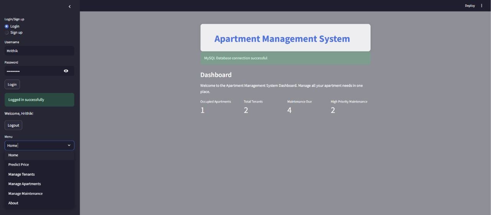
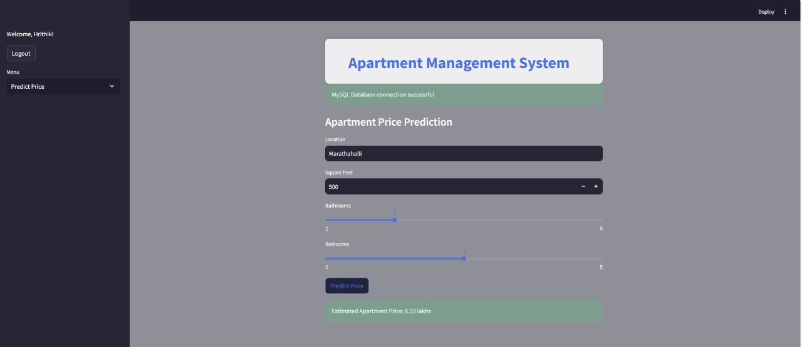
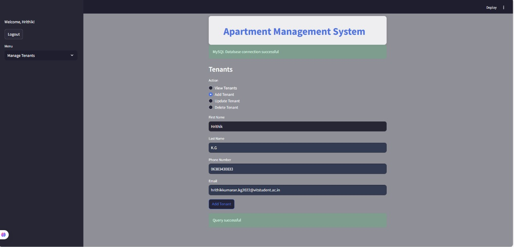
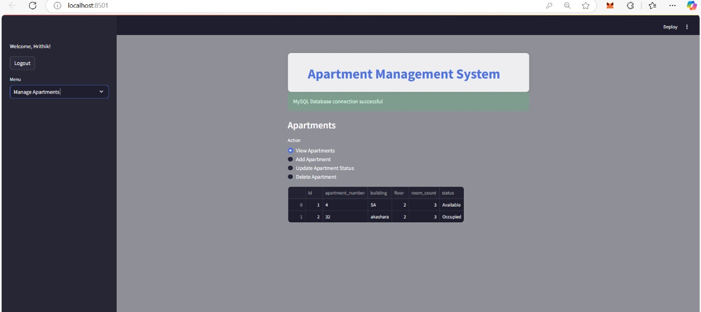
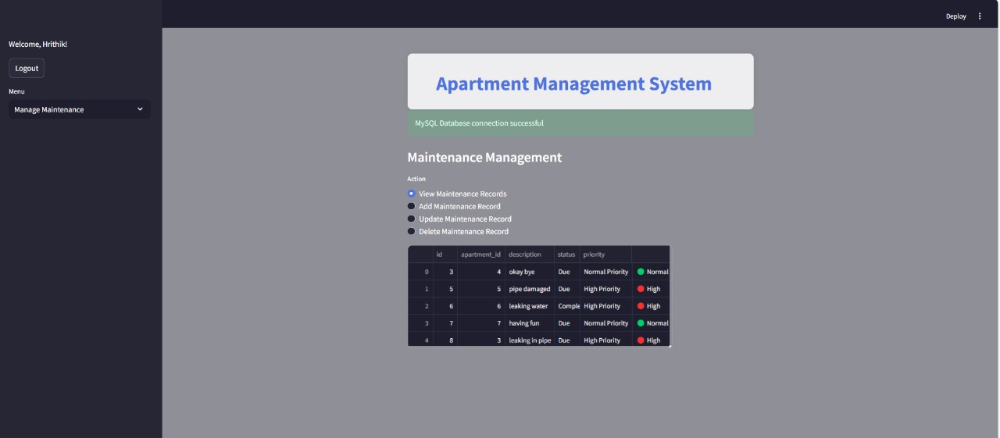

# 🏢 Apartment Management System


An intelligent, full-stack **Apartment Management System** built with **Streamlit** and powered by **MySQL** and a **machine learning model** trained on the Bangalore housing dataset. This system simplifies tenant management, apartment listings, maintenance records, and even predicts apartment prices using ML.

---

## 🌟 Features

- 🔐 **Login & Sign Up System** (with password hashing using SHA-256)
- 🧠 **Apartment Price Prediction** using a trained ML model
- 🧍 **Tenant Management** (Add, View, Update, Delete)
- 🏬 **Apartment Management** (Add, View, Update, Delete)
- 🛠️ **Maintenance Tracking** with **NLP-based urgency detection**
- 📊 **Dashboard** for visual summaries of apartment status and maintenance
- 🎨 Clean and modern **UI** with CSS-styled enhancements
- 📦 Modular, scalable backend using MySQL for all data storage

---

## 🚀 Screenshots

### 🔐 Login & Dashboard


### 🧠 Apartment Price Prediction


### 👥 Tenant Management


### 🏬 Apartment Listings


### 🛠️ Maintenance Requests with NLP-based Priority


---

## 🛠️ Technologies Used

| Technology | Description |
|------------|-------------|
| Python | Backend logic, ML integration |
| Streamlit | Frontend framework |
| MySQL | Relational database |
| Joblib | ML model serialization |
| Scikit-learn | For model training |
| NLTK | For natural language priority detection |
| CSS | For custom styling and overlays |

---

## 📈 Model Info

- **Dataset Used**: Bangalore Housing Dataset
- **Model Type**: Linear Regression
- **Features Used**: Location (One-hot encoded), Square Footage, BHK, Bathroom
- **Saved with**: `joblib`

---

## 🧪 NLP-based Priority Detection

Using NLTK:
- Text from maintenance requests is **tokenized and stemmed**
- Compared against a curated **urgent keyword list**
- Classifies the issue as **"High Priority"** or **"Normal Priority"**

---

## ⚙️ Setup Instructions

1. **Clone the Repository**:
   ```bash
   git clone https://github.com/yourusername/apartment-management-system.git
   cd apartment-management-system
   ```

2. **Install Requirements**:
   ```bash
   pip install -r requirements.txt
   ```

3. **Set up MySQL Database**:
   - Create a database `apartment_management`
   - Import required tables (tenants, apartments, maintenance, users)

4. **Place ML Files**:
   - Place `finalized_model.pkl` and `model_columns.pkl` inside `C:\streamlit_project\`

5. **Run Streamlit**:
   ```bash
   streamlit run app.py
   ```

---

## 🔐 Default Database Tables

- `users` – For login/sign-up
- `tenants` – First name, last name, contact, email
- `apartments` – Floor, room count, status
- `maintenance` – Description, status, and priority

---

## 📌 Highlights

✅ **Session-based login**  
✅ **Integrated ML price predictor**  
✅ **NLP for smart priority**  
✅ **Visual dashboard**  
✅ **Custom CSS styling**

---
## ⭐ Show Some Love

If you like this project, consider giving it a ⭐ on GitHub!
